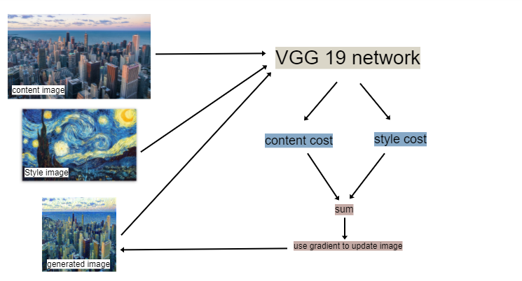

# Neural-Style-Transfer
by Yashaswi Yenugu

# What is Neural Style Transfer
Neural Style Transfer is a technique to blend two images - a *content* image and a *style* image - such that
the content image looks like it was painted in the style of the style image.
The blended image is called *generated* image.

The style image I have used is a painting called *Starry Night* by Vincent van Gogh

# How is it Done?
The generated image is initially defined as the content image.
The *content* and *style* images are put into a neural network (VGG19 in this case) and the outputs from a particular layer are extracted by forward propagation.
Let the activations from the network for the *content(C)* and *generated(G)* images be ***ac*** and ***ac*** respectively.

Then we evaluate the *content cost* defined as follows:

Similarly we evaluate the *style cost*.
We need to introduce *Gram matrices* for this.
A Gram matrix of a set of vectors (v1,v2 .... vn) is defined as:

The *style cost* is defined as:

The entire cost function then would be defined like this:

Where alpha and beta are hyperparameters you need to tune.

Once the cost is evaluated (forward propagation) the network evaluates the derivative of the cost with respect to the generated image
and carries out backward propagation.
The procedure is summarised in the picture below:

# Instructions

1. Download the images *content.jpeg* and *style.jpg*
2. Open the file *Neural_Style_Transfer.ipynb* and open it using google colab.
3. Switch the runtime type to 'GPU' for faster execution.
3. Run the cells and upload the images *content.jpeg* and *style.jpg* when asked by the notebook.
4. In case you want to upload your own images, you can do so. Change the hyperparameters accordingly.
5. Save the generated image.
